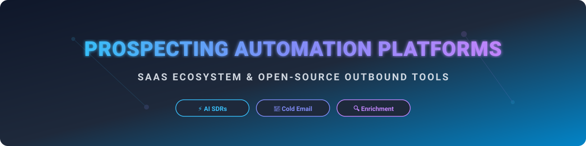

  

# 🚀 Awesome Prospecting Automation Platform Ecosystem 

  
  
  
  

> **The Ultimate Curated List of SaaS Platforms & Open-Source Tools for B2B Sales Outreach ✉️, Cold Email Sequencing 🚀, Lead Data Enrichment 🔍, and Autonomous AI SDRs 🤖.**

Welcome to the definitive repository tracking the **prospecting automation** and **sales engagement platform (SEP)** software landscape 🌐. Whether you are an enterprise sales leader 💼, growth marketer 📈, or technical founder 💻 building a self-hosted outbound stack, this ecosystem guide highlights top-tier commercial SaaS products and production-ready open-source GitHub repositories.

---

## 📌 Table of Contents

- [📊 Market Landscape Overview](#-market-landscape-overview)
- [🏢 SaaS/Hosted Prospecting Platforms](#-saashosted-prospecting-platforms)
- [💻 Open-Source GitHub Projects](#-open-source-github-projects)
- [🤝 How to Contribute](#-how-to-contribute)
- [❤️ Support & Sponsorship](#%EF%B8%8F-support--sponsorship)
- [📈 Star History](#-star-history)
- [⚠️ Disclaimer](#%EF%B8%8F-disclaimer)

---

## 📊 Market Landscape Overview

The global **Sales Engagement & Prospecting Automation Market** was valued at approximately **$3.8 Billion in 2024** and is projected to expand at a compound annual growth rate (CAGR) of over **18.5%**, surpassing **$12.5 Billion by 2032** 📈. 

### 💡 Market Dynamics: **Moderately Fragmented (Transitioning to AI-First Winners)**
- **🏢 Enterprise Core (Concentrated):** Legacy category leaders like *Outreach* and *Salesloft* dominate enterprise revenue operations and complex CRM workflows.
- **⚡ Product-Led & High-Growth Platforms (Highly Fragmented):** Mid-market and SMB segments remain vibrant with intense competition among data enrichment engines (*Clay*), all-in-one databases (*Apollo.io*), deliverability sequencers (*Smartlead*, *Lemlist*), and emerging autonomous AI SDR startups (*11x.ai*, *Artisan AI*).

---

## 🏢 SaaS / Hosted Platforms

Below is a curated index of leading commercial prospecting and outreach platforms, sorted in descending order by estimated valuation/market presence 🏆.

| Platform | Primary Focus & Capabilities | Valuation / Market Scale | Starting Price | Free Tier / Trial Limits |
| :--- | :--- | :--- | :--- | :--- |
| **[Clay](https://www.clay.com/)** | AI-powered GTM, 75+ data provider enrichment, and hyper-personalized automated outreach workflows. | **$7.1B Valuation** ($200M ARR) | $149 / month | Free Forever Plan (100 credits/month) |
| **[Outreach](https://www.outreach.io/)** | Enterprise revenue workflow platform, multi-touch sales execution, AI revenue intelligence. | **$4.4B Valuation** (~$300M+ ARR) | Custom (~$100 / user / mo) | 14-day Free Trial available upon request |
| **[Salesloft](https://www.salesloft.com/)** | Enterprise sales engagement, deal forecasting, AI conversation intelligence (Acquired by Vista / Clari). | **$2.3B Valuation** (~$450M combined ARR) | $75 / user / month | 14-day Free Trial available upon request |
| **[Apollo.io](https://www.apollo.io/)** | All-in-one prospecting database, contact enrichment, cold email sequencing, and built-in dialer. | **$1.6B Valuation** ($150M ARR) | $49 / user / month | Free Forever Plan (10,000 email credits/mo + 60 export credits/yr) |
| **[11x.ai](https://www.11x.ai/)** | Autonomous AI Sales SDR agents (Alice & Jordan) for end-to-end automated cold prospecting. | **$350M Valuation** (~$10M ARR) | $500 / month | 7-day Free Trial (Demo & pilot upon request) |
| **[Lemlist](https://www.lemlist.com/)** | Personalized cold outreach, image/video dynamic personalization, deliverability warmup. | **$150M Valuation** ($50M ARR) | $55 / user / month | 14-day Free Trial (No credit card required) |
| **[Reply.io](https://reply.io/)** | Multichannel sales engagement (Email, LinkedIn, Calls, WhatsApp) and AI SDR Jason. | **~$50M Valuation** ($15M ARR) | $49 / user / month | 14-day Free Trial (Full access to multichannel features) |
| **[Smartlead](https://www.smartlead.ai/)** | High-volume cold email infrastructure, unlimited inbox warmup, and central master inbox. | **~$40M Valuation** ($12M ARR) | $39 / month | 14-day Free Trial (No credit card required) |
| **[Woodpecker](https://woodpecker.co/)** | B2B cold email and follow-up sequence automation with deliverability monitoring. | **~$30M Valuation** ($8M ARR) | $29 / month | 7-day Free Trial (50 cold emails included) |
| **[Snov.io](https://snov.io/)** | Email finder, domain verifier, automated drip campaigns, and sales CRM platform. | **~$25M Valuation** ($7M ARR) | $30 / month | Free Forever Plan (50 credits/mo + 100 recipients) |
| **[Mailshake](https://mailshake.com/)** | Simple cold email outreach tool, phone dialer, and social selling sequence platform. | **~$20M Valuation** ($5M ARR) | $58 / user / month | 30-day Money-Back Guarantee (No traditional free trial) |
| **[QuickMail](https://quickmail.com/)** | Deliverability-focused cold email software for agencies and outbound growth teams. | **~$15M Valuation** ($4M ARR) | $49 / month | 14-day Free Trial (3,000 emails/month limit) |
| **[UserGems](https://www.usergems.com/)** | Buyer job change tracker and signal-based pipeline generation triggers. | **~$15M Valuation** ($4M ARR) | Custom (~$1,000 / month) | 14-day Free Trial / Custom proof of concept |
| **[Regie.ai](https://www.regie.ai/)** | Generative AI agent platform for autonomous prospect engagement and custom content sequencing. | **~$12M Valuation** ($3M ARR) | $59 / user / month | 14-day Free Trial (Limited AI generation credits) |
| **[Common Room](https://www.commonroom.io/)** | Signal-based GTM platform aggregating product activity, community intent, and outbound workflows. | **~$10M Valuation** ($3M ARR) | $499 / month | Free Forever Plan (Up to 1,000 activity contacts) |
| **[Amplemarket](https://www.amplemarket.com/)** | All-in-one AI sales platform integrating lead discovery, dynamic copy, and multi-channel outreach. | **~$10M Valuation** ($3M ARR) | Custom (~$300 / user / mo) | 14-day Free Trial upon product demo |
| **[Artisan AI](https://www.artisan.co/)** | AI SDR Ava for end-to-end prospect discovery, copy creation, and automated email sending. | **~$10M Valuation** ($2M ARR) | $300 / month | 7-day Free Trial upon qualification demo |
| **[Persana AI](https://www.persana.ai/)** | Intelligent sales prospecting assistant leveraging fine-tuned LLMs and intent signals. | **~$5M Valuation** ($1M ARR) | $85 / month | 14-day Free Trial (500 enrichment credits) |
| **[Octave](https://www.octavehq.com/)** | AI GTM platform for target account intelligence and personalized sales messaging. | **~$5M Valuation** ($1M ARR) | Custom (~$200 / month) | 14-day Free Trial upon request |

---

## 💻 Open-Source GitHub Projects

Below is a curated collection of self-hosted email sequencers, AI SDR agents, lead scraping scripts, and CRM utilities ⭐. Repositories are sorted in descending order by GitHub Star count.

| Repository | GitHub_Stars | Focus & Description |
| :--- | :--- | :--- |
| **[NocoBase](https://github.com/nocobase/nocobase)** |  | Extensible open-source no-code collaboration and CRM platform for managing lead pipelines. |
| **[EspoCRM](https://github.com/espocrm/espocrm)** |  | Highly customizable open-source CRM application for tracking leads, accounts, and contacts. |
| **[Email Sleuth](https://github.com/buyukakyuz/email-sleuth)** |  | Python utility for finding and verifying corporate email addresses via name and domain pattern discovery. |
| **[Oneshot GTM](https://github.com/oneshot-agent/oneshot-gtm)** |  | Open-source Go-to-Market CLI & local dashboard agent for cold email personalizations and pipeline management. |
| **[Warmbly](https://github.com/warmbly/warmbly)** |  | Open-source self-hosted cold email warmup and deliverability platform for multi-inbox rotation. |
| **[B2B SDR Agent Template](https://github.com/iPythoning/b2b-sdr-agent-template)** |  | Open-source AI Sales Development Representative template managing multi-stage outbound outreach pipelines. |
| **[Awesome AI Lead Gen](https://github.com/toofast1/awesome-ai-lead-generation)** |  | Curated collection of AI tools, scripts, and frameworks for lead generation and social prospect monitoring. |
| **[Coldflow](https://github.com/pypesdev/coldflow)** |  | Functional open-source cold email sequencer supporting CSV contact uploads, spintax templates, and reply detection. |
| **[seqd](https://github.com/getbeton/seqd)** |  | Self-hosted personal email sequencer built with Next.js & PostgreSQL featuring Gmail OAuth integrations. |
| **[Harvey AI Sales Agent](https://github.com/ethanplusai/harvey)** |  | Autonomous AI sales outreach agent powered by Claude Code for automated cold email writing and booking. |
| **[OpenOutreach](https://github.com/eracle/OpenOutreach)** |  | CLI-based open-source AI agent for B2B prospect discovery, deep company research, and target drafting. |
| **[openleads](https://github.com/Samyrrrrrr990/openleads)** |  | Free, self-hosted open-source alternative to Apollo.io for finding and verifying business emails. |
| **[Sequencer](https://github.com/buricodes/sequencer)** |  | Lightweight drag-and-drop outreach sequence builder with delay scheduling and template variables. |

---

## 🤝 How to Contribute

Contributions are welcome! Please follow these simple guidelines:

1. Fork the repository 🍴.
2. Add your product or open-source tool to `README.md` following the established table structure.
3. Ensure all pricing, star count badges, links, and market metrics are factual and up to date.
4. Create a Pull Request with a clear summary of your additions 📝.

---

## ❤️ Support & Sponsorship

If you found this repository helpful, please consider showing your support:
- ⭐ **Star** this repository to help others discover it!
- 🍴 **Fork** it to keep a copy and contribute back.
- 📢 **Share** it with your sales engineering, GTM, and developer teams.
- ☕ **Buy me a coffee / Sponsor**: If you'd like to support ongoing maintenance and research, check out the [GitHub Sponsor Dashboard](https://github.com/sponsors/ishandutta2007).

---

## 📈 Star History

---

## ⚠️ Disclaimer

- This list is **community-curated** for educational and research purposes 📚.
- Users are responsible for ensuring that all outbound emailing and data scraping activities comply with local and international anti-spam regulations (e.g., CAN-SPAM Act, GDPR, CASL) and third-party terms of service ⚖️.
